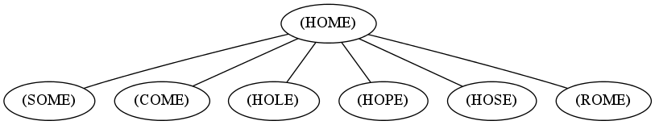

I want to talk about *Lisp* because so far I can say that I am really loving it and I will certainly be spending more time with it and learning about it.

Allow me to quickly tell you about a little nice puzzle:

#### Word ladder Puzzle
This [puzzle][word-ladder] was invented by Lewis Carroll a long time ago. The
puzzle is defined by three elements, a language (for our purposes
a dictionary with plenty of words of the same length), a _start word_ and an
_end word_. The goal is to find a path between the two words by changing a
single character at the time, and the resulting words from such change have to
be valid words in the given language.

Example for `HOME` and `MEAL`:


HOME -> HOLE -> HOLD -> HELD -> HEAD -> HEAL -> MEAL


#### Solving it

So, armed with my new rudimentary skills of [Common Lisp][common-lisp] I decided to write a
Lisp solver of this puzzle. The [code][code] is in Github, along with a ruby
implementation I wrote a while ago. I will reproduce the Lisp version here in
order to explain the way I solved it, maybe I can pique your interest and you
want to learn about it too.

First, we have to have some dictionaries handy, I already have [some][code] up
in Github that you can download. Now that we have a nice dictionary, we have to
read it and have it handy, in Common Lisp:


(defparameter *dictionary* ())

(defun read-dictionary-file (fname)
  (with-open-file (stream fname)
    (loop for line = (read-line stream nil 'foo)
       until (eq line 'foo)
       collect line)))

(defun initialize-dictionary (fname)
  (let* ((dictionary (read-dictionary-file fname))
         (first-len (length (first dictionary))))
    (setq *dictionary*
          (remove-if-not (lambda (word)
                           (eql (length word)
                                first-len))
                         dictionary))))


The first line simply defines a global variable named `*dictionary*` (the \*
around the name is a naming convention) to be an empty list. Then we declare two
functions:

<dl>
<dt>read-dictionary-file</dt>
<dd>
Opens the file with the given filename, reads every line and returns them as a list.
</dd>
 
<dt>initialize-dictionary</dt>
<dd>
Calls read-dictionary-file and stores the given list in a local variable, then it gets the length of the first word in the dictionary and removes every word from the list if its length is not equals, a basic check, finally it saves the result into the ==*dictionary*== global variable.
</dd>
</dl>

If you have a flavor of Common Lisp installed, we can already test this
functions in the [read-print-eval-loop][repl]:


[10]> (initialize-dictionary "dictionaries/four-char-dictionary.txt")
("mitt" "that" "with" "they" "this" "have" "from" "word" "what" "were" "when"...

[11]> *dictionary*
("mitt" "that" "with" "they" "this" "have" "from" "word" ...

[12]> (length *dictionary*)
923


Now that we have our dictionary handy, let's think a bit about the problem. We
want to find a way between two given words, we start from one word, how do we
know what our options are to move from a word to another?

A way to visualize this problem is as a [graph][graph] where every word is
represented as node and the edges connect nodes which are apart only by
a single character.

For example, in a dictionary with english words of four characters, the word
"home" has the following neighbors:

Here's the code to find the neighbors of a word in our dictionary in Lisp:


(defun one-apart-p (w1 w2)
  (and (eql (length w1) (length w2))
       (= 1 (loop
               for c1 across w1
               for c2 across w2
               count (not (equalp c1 c2))))))

(defun find-neighbors (word dictionary)
  (when (member word dictionary :test #'equalp)
    (remove-if-not (lambda (x)
                     (one-apart-p word x))
                   dictionary)))


<dl>
<dt>one-apart-p</dt>
<dd>
It's a predicate, that is, it returns true or false. It is a convention in Common Lisp to suffix predicate functions with _-p_. What it does is that given two words, it loops across them counting how many differences they have. If they have only one difference it returns true, else false.
</dd>
 
<dt>find-neighbors</dt>
<dd>
Takes a word and a dictionary and returns a list of all the words in the given dictionary that are one character apart from the given word. All its neighbors!
</dd>
</dl>

Running the code:


[61]> (find-neighbors "home" *dictionary*)
("some" "come" "hole" "hope" "hose" "Rome")


Now that we can find the adjacent words for each word in our dictionary, we can
find our ladders. There are two basic ways to traverse the graph, which are:

<dl>
<dt>Breadth-first</dt>
<dd>
We check the current level before moving onto the next one, that is, we check if
our target word is in the neighbors list, in our example, `home` to `meal` we
check if `meal` is in the neighbors of `home`, it is not so the next step is to
move one level down, we do this by having a list of all the neighbors of the
neighbors (recursively), then we check again, if not we move down another level
and so on.
</dd>
 
<dt>Depth-first</dt>
<dd>
We get our list of neighbors, then we check against the first one, if it is not
our target, we get its list of neighbors, check against the first one, if not we
get its list of neighbors... you see what I mean, basically, you go as deep as
you can in the graph, if you hit a dead-end you go back to a level where you
have more neighbors and then you go deep on that too. Wikipedia has some nice
animated gifs showing how this works.
</dd>
</dl>

In my implementation I chose breadth-first, is way faster than depth-first for
this particular problem, other problems may be better served by a depth-first
approach.

The code:


(defun find-ladder (first second dictionary)
  (labels ((follow-ladders (ladders visited)
             (let ((already-visited (nconc visited
                                           (mapcar #'first ladders)))
                   (matching-ladder (find-if (lambda (ladder)
                                               (equalp second (first ladder)))
                                             ladders)))
               (if matching-ladder
                   matching-ladder
                   (follow-ladders (mapcan (lambda (ladder)
                                             (mapcar (lambda (neighbor)
                                                       (cons neighbor ladder))
                                                     (set-difference (find-neighbors (first ladder) dictionary)
                                                                     already-visited
                                                                     :test #'equalp)))
                                           ladders)
                                   already-visited)))))
    (follow-ladders (list (list first)) nil)))


A bit long, but basically we are given two words and the dictionary, we define a
local function with the labels keyword, this allows the function to call itself
recursively.

Our local function takes two parameters, `ladders` and `visited`. Ladders is a
list of lists where the first element is the word to follow, the function also
creates two local variables, `already-visited` which holds a list of the nodes
we have already checked and `matching-ladder` which checks if there is already a
complete ladder.

If the ladder is found then return it and we are done. If not, `follow-ladders`
calls itself recursively by adding the neighbors of all the current words to our
ladders, always checking against `already-visited` so we don't follow the same
node twice.

`find-ladder` basically calls the local function by creating a list with the
first word and an empty list of visited nodes.

Running the code:


[62]> (find-ladder "home" "meal" *dictionary*)
("meal" "heal" "head" "held" "hold" "hole" "home")


And that's it! A breadth-first solver for the word ladder puzzle.

#### Closing remarks

One of the first shocks for programmers like me, accustomed to imperative
languages (at the time of this writing I do C# for a living) is that there are
too many [parentheses][parentheses], but then I realized (thanks to [Land Of
Lisp][land-of-lisp] that they are simply lists of lists (or trees).

Lisp is very homoiconic, which is a fancy word to say that the representation of
the program is a primitive type of the programming language itself, this has the
natural consequence of Lisp being able to process Lisp code itself, which is the
concept of macros (unlike languages like C where a macro is simply text
substitution), in Lisp functions take values and return values (as in every
language) but macros take Lisp code and return Lisp code.

I am really liking Lisp, I will certainly be using it as often as I can to solve
anything I can get my hands on to improve my almost non-existent skills. Which,
if you are an amazing Lisper, please do not be offended if my code sucks, I am
trying to learn, feel free to send me an email with any suggestion you may have!

Which reminds me, I would like to thank [Peter Seibel][peter-seibel], author of
[Coders at Work][coders-at-work] and [Practical Common Lisp][practical-lisp]
because he took the time to look at my original code and give me some very
useful tips after I bugged him on IRC (go read his books, they are great).

Thank you Peter!

[word-ladder]:    https://en.wikipedia.org/wiki/Word_ladder
[common-lisp]:    https://en.wikipedia.org/wiki/Common_Lisp
[code]:           https://github.com/ebobby/word-ladder
[repl]:           https://en.wikipedia.org/wiki/Read–eval–print_loop
[graph]:          http://en.wikipedia.org/wiki/Graph_(mathematics)
[parentheses]:    http://symbo1ics.com/blog/?p=275
[land-of-lisp]:   http://www.amazon.com/Land-Lisp-Learn-Program-Game/dp/1593272812%3FSubscriptionId%3DAKIAJHTAM7STAKSLLXRQ%26tag%3Dws%26linkCode%3Dxm2%26camp%3D2025%26creative%3D165953%26creativeASIN%3D1593272812
[peter-seibel]:   http://www.gigamonkeys.com
[coders-at-work]: http://www.amazon.com/Coders-Work-Reflections-Craft-Programming/dp/1430219483%3FSubscriptionId%3DAKIAJHTAM7STAKSLLXRQ%26tag%3Dws%26linkCode%3Dxm2%26camp%3D2025%26creative%3D165953%26creativeASIN%3D1430219483
[practical-lisp]: http://www.amazon.com/Practical-Common-Lisp-Peter-Seibel/dp/1590592395%3FSubscriptionId%3DAKIAJHTAM7STAKSLLXRQ%26tag%3Dbookistics-20%26linkCode%3Dxm2%26camp%3D2025%26creative%3D165953%26creativeASIN%3D1590592395
