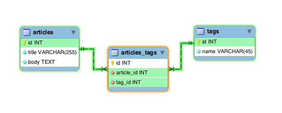
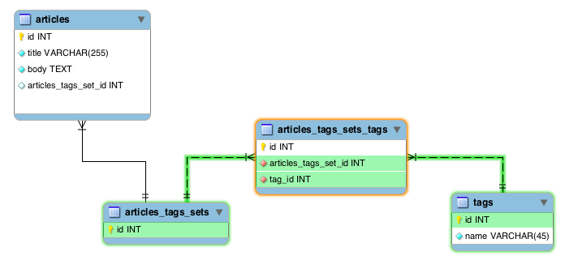

### What’s a many-to-many?

It is very common when dealing with data modeling to find
[many-to-many](http://en.wikipedia.org/wiki/Many-to-many_\(data_model\))
relationships, that is, given two entities or tables (in
[SQL](http://en.wikipedia.org/wiki/SQL) parlor) having many related rows
in both sides, that is, each table can have many related rows in the
other table and viceversa.

A common example of this is articles and tags, one article can have many
tags and one single tag can belong to many articles. Another example is
books and readers, one reader can read many books, and one book can be
read by many readers. And yet another more contrived example is the
concept of “followers” in many social networks, when one user can follow
many users, and one user can be followed by many users, even though
there is a many to many relationship, it relates the table to itself.

### Classic schema

So, how do we model an schema for such kind of relationship? I will
first describe the regular *textbook* way of doing it, along with its
advantages and disadvantages.

To help me in this exercise I will use articles/tags schema as an
example, given that problem the model will probably end up looking like
this:

We have our tables, articles and tags, and we use a third table to help
us with the relationship, this is usually called **join table**,
Wikipedia calls them [junction tables](http://en.wikipedia.org/wiki/Junction_table).

The join table has foreign keys to both of our main tables, that is, a
row creates a single relationship between our tables, many rows create
many-to-many relationships.

Is easy to go from one side to another, that is, to see what tags any
given article has, or to find what articles have a certain tag. For
example, the next query would give all the articles and their tags:


select articles.title, tags.name from articles
    inner join articles_tags on articles_tags.article_id = articles.id
    inner join tags on tags.id = articles_tags.tag_id;

           title           |    name
---------------------------+-------------
 Buzzword about buzzwords! | open source
 Buzzword about buzzwords! | ruby
 Buzzword about buzzwords! | programming
                          ...


#### Advantages

This model is the only way to go when you need more data about the
relationship, for example, when it was created, by whom, or maybe the
relationship status, like “Approved”, “On Hold”, “Canceled”, etc., it
depends on your data and your business needs.

Yet another advantage is that changing the relationships is easy, if you
need to add or remove some it is very straightforward and you just
modify the single rows you need, everything else is untouched.

#### But…

This model is very redundant if you only care about the relationships
themselves and you have natural low
[cardinality](http://en.wikipedia.org/wiki/Cardinality_\(data_modeling\))
in your data, that is, the same combinations repeat over and over, like
in my given example, if many articles have the same tags. That is very
common.

It would look something like:


  article_id | tag_id
-------------+-------------
      1      |    1
      1      |    2
      2      |    1
      2      |    2
      3      |    1
      3      |    2
            ...
      N      |    1
      N      |    2


Notice how the same tags (1 and 2) are repeated over and over and over,
if you have 1,000,000 articles with the same two tags, you would have
2,000,000 rows for them in the join table, now, although this may seem
very unlikely to happen in a blog application, the same principles hold
for many other data sets that may be in the order of millions of rows.

This is not only wasted space, space is cheap, but when you are talking
in the context of a database, space becomes important because the
smaller your tables, the smaller your indexes, the less I/O you have to
do to access your tables, your database manager will cache more of it,
etc. All in all, the less rows you have, the faster you can do
operations with them.

If you work with an application that is in the hundreds of thousands or
millions of rows I strongly recommend you to check your join tables.

Here’s a query for [postgresql](http://www.postgresql.org/) to find out
how many repetitions and redundancy you have in your join tables,
although it’s tailored for the example it should be easy to change it
for your own database and schema:


--  Sample database has 1000 random articles with 5 tags in random combinations.
select
    tags, COUNT(article_id) repetitions
from (select
          article_id,
          array_agg(tag_id order by tag_id) tags
      from articles_tags
      group by article_id) as a
group by tags
order by COUNT(article_id) desc;

     tags    | repetitions
-------------+-------------
 {3}         |          51
 {5}         |          44
 {4}         |          40
 {2}         |          38
 {3,4,5}     |          34
 {3,4}       |          33
 {1}         |          32
 {1,3,5}     |          31
 {1,3,4}     |          29
 {3,5}       |          28
            ...


Scared?

#### What is the problem exactly?

Fun fact, there is really no other way to do many-to-many relationships
where you have the full advantages of a relational database, like
referential integrity, index usage, etc.

**So how do we go about reducing the redundancy?**

The redundancy results from the fact that we have the *reference* to our
main table in the join table, so when we need to create a combination it
doesn’t matter if we have seen that particular combination before, we
have to create it anyway because there is no way we can reuse it because
can’t stuff it in our previous rows.

How about we pull out the reference to the first table from the join
table and we leave the reference to the second table?

This may sound a bit confusing so let me show you what I mean:

### Set schema

#### What is a set?

I am going to quote Wikipedia entry for [sets](http://en.wikipedia.org/wiki/Set_\(computer_science\)):

> In computer science, a set is an abstract data structure that can
> store certain values, without any particular order, and no repeated
> values. It is a computer implementation of the mathematical concept of
> a finite set.

A data structure for values with no repetitions, that sounds like
something we could use for our little “redundancy” problem…

#### What is going on here?

Basically, instead of introducing just a join table we also introduce a
another table, a `Sets` table.

Instead of relating `articles` and `tags`, we relate `sets` and `tags`.

Image this work flow:

User one:

  - User creates an article, selects two given tags for this article.
  - We create the tags if they do not exist.
  - We ask ourselves this question, do we have this combination of tags
    already in `articles_tags_sets_tags` table?
  - No we do not, so we create an `articles_tags_sets` row.
  - Using the ID of this new set item we create the
    `articles_tags_sets_tags` rows like:


articles_tags_set_id | tag_id
---------------------+--------
                   1 |      1
                   1 |      2


  - Now we have a suitable set item for our article, so we create the
    article and relate it to this using the column in articles
    `articles_tags_set_id`.

User two:

  - User creates an article, selects two given tags for this article.
  - Tags already exist so we do not have to create them.
  - We ask ourselves this question, do we have this combination of tags
    already in `articles_tags_sets_tags` table?
  - Yes we do, so we only grab the `id` of `articles_tags_sets` that
    represent this combination.
  - Using this suitable set item id we create the `articles` row.

See what we did here? We created two articles but we **reused** the set
item and every time a new article comes that has a combination of tags
that we have seen before, we can reuse it, not copy it over and over.

Since we took the `article_id` from the join table and introduced the
`set_id` instead we can create a single copy and reuse it in as many
articles as we want, if we have two tags and we have a 1,000,000
articles using these two tags, we would still have two single rows in
our join table. Pretty impressive isn’t it?\!

This is called a *Set* because the combinations are unique, a set item
is a distinct combination of tags.

#### Queries

**How do we find what tags belong to an article?**


select articles.title, tags.name from articles
    inner join articles_tags_sets_tags on articles_tags_sets_tags.articles_tags_set_id = articles.articles_tags_set_id
    inner join tags on tags.id = articles_tags_sets_tags.tag_id;

           title           |    name
---------------------------+-------------
 Buzzword about buzzwords! | programming
 Buzzword about buzzwords! | startups
 Buzzword about buzzwords! | ruby
                          ...


Looks familiar? It is, is almost the same query, but instead of having
the `article_id` in the join table, the article table has the
`articles_tags_set_id`. The behavior of this query is exactly the same
as the first one, so finding your relationships has no cost whatsoever
and since this table will grow to a fraction of a regular join table
when you go to the order of hundreds of thousands of rows, this join
will be faster because the database has a lot less rows to deal with.

**How do we find if an existing set item already exists?**


select articles_tags_sets.id set_item_id
from articles_tags_sets_tags
    join articles_tags_sets on articles_tags_sets.id = articles_tags_sets_tags.articles_tags_set_id
where
    articles_tags_sets_tags.tag_id IN (3,1)
and (select count(*) from articles_tags_sets_tags c
     where c.articles_tags_set_id = articles_tags_sets_tags.articles_tags_set_id) = 2
group by articles_tags_sets.id
having count(*) = 2

 set_item_id
------------
          20


Not the most simple query, but not exactly complicated either, we simply
find first the set items that match the count of our rows (two in this
case) and then find the one that matches exactly our combination.

#### Caveats

This technique though is not exactly free. There are several
disadvantages to it.

First and foremost, it has an extra cost when saving and updating. Every
time we have to save a row in the parent table and related rows, we have
to check first if this particular combination of children exists, if
they do not, we have to create them, as opposed as just dumping rows in
the join table.

When updating, if you add a new row to the combination we are now
dealing with a new set item that has to be checked for, if it does not
exist we have to create it entirely as opposed to inserting a single row
to the join table.

This cost gets amortized with time and usage, when the system is fairly
new and no set items yet exist, set items will get created all the time,
after a while reuse will be more common since many different
combinations will now exist.

Which bring us to another problem, your data has to have a natural
tendency for redundancy, like in our articles and tags. Otherwise you
will be creating new set items all the time as opposed to be reusing
them, you have to analyze your data (you can use the query I gave above)
and see if you have a lot of repetitions and redundancy and determine if
this technique is for you. You can probably apply it to some tables as
opposed to your entire database.

Yet another problem is that this only applies to when your relationship
is the only data you need, if you need more information for each
relationship you cannot use this technique because relationships are
“shared” among many parent rows. You can try to move that data into
your second table but that will reduce redundancy and compression.

### Real world usage

As an example of real world usage of this, let me share with you some
data of one of the databases at my job.

We have songs, each song has clearance to some countries (3-5 average)
and each song has different ways to be sold (streaming, download, radio,
etc).

Each song/country combination has many ways to be sold in that given
country, so we have to have a many-to-many relationship here.

**Numbers**

<table class="table table-bordered">
<tr>
<th>
Table
</th>
<th>
# of rows
</th>
</tr>
<tr>
<td>
Song
</td>
<td>
2.5 million
</td>
</tr>
<tr>
<td>
LocalizedSong (song/country)
</td>
<td>
12 million
</td>
</tr>
<td>
DistributionType (ways to sell)
</td>
<td>
34
</td>
</tr>
</table>

We have in average 10-15 different distribution type relationships for
each song/country.

Using a regular join table we would have 125 million rows in average, we
had that problem and it made it very difficult to us to scale our
queries. (This is not the only many-to-many relationship we have, we
have a complex data model).

Once we switched to this technique for this relationship because in this
particular situation we have low cardinality (many albums from the same
label have the same clearances and distribution types, or the songs in a
given album have the same distribution types, etc), we have the
outstanding number of 22k rows in our relationship table. See that
number? 22k.

When you operate at that scale, this is very, very helpful.

### Conclusions

For you Ruby people, I took this concept explained here and began
working on wrapping it nicely in a gem that extends ActiveRecord to use
it. The gem is called **has-many-with-set** and you can find the source
code (and instructions for installation/usage) in
[github](https://github.com/ebobby/has-many-with-set).

Do you like it? Have any doubts? Let me know, we can talk about it. This
was designed at my job, [INgrooves
Fontana](http://www.ingroovesfontana.com/) as part of our scaling
efforts and now we share the concept with you, I hope you like it and at
least learn a little bit reading it. (It’s worth noting that we do not
use Rails nor Ruby at my work).

If you find a use for this and saves your company of buying more servers
and you become your office’s hero let me know, that will make me very
happy.
